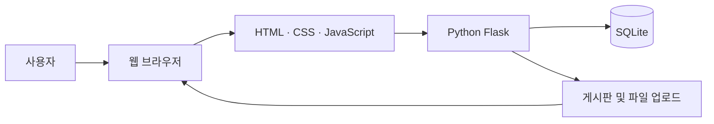

# COMEDUWEB 동아리 웹사이트

> **HTML·CSS·JavaScript와 Python Flask를 활용한 컴퓨터교육과 학습 동아리 웹사이트**

COMEDUWEB 웹사이트는 동아리의 활동 목적과 운영진을 소개하고, 공지사항과 프로젝트 진행 상황을 게시판으로 관리하기 위해 제작한 웹 프로젝트입니다.

<p align="center">
  
</p>

---

## 프로젝트 개요

| 구분 | 내용 |
|---|---|
| 프로젝트명 | 2024 COMEDUWEB 웹 프로젝트 |
| 개발 기간 | 2024년 5월 ~ 2024년 10월 |
| 교육 및 기초 학습 | 2024년 5월 ~ 2024년 8월 |
| 웹사이트 제작 | 2024년 9월 ~ 2024년 10월 |
| 개발 형태 | 3인 팀 프로젝트 |
| 프로젝트 분야 | 동아리 소개 및 게시판 웹사이트 |
| 프론트엔드 | HTML, CSS, JavaScript |
| 백엔드 | Python, Flask |
| 데이터베이스 | SQLite |
| 디자인 기반 | StartBootstrap |
| 개발 도구 | Visual Studio Code |

---

## 프로젝트 소개

COMEDUWEB는 컴퓨터교육과 학생들이 웹 개발 기초를 학습하고, 실제 동아리 웹사이트를 제작하기 위해 진행한 프로젝트입니다.

웹사이트에서 동아리의 목적과 활동 내용을 소개하고, 공지사항과 프로젝트 진행 상황을 게시판 형태로 제공할 수 있도록 구성했습니다. 이메일, 인스타그램, 구글 폼을 통한 문의 방법도 함께 제공하여 방문자가 운영진과 쉽게 연락할 수 있도록 했습니다.

---

## 주요 화면

### 메인페이지

동아리의 핵심 소개, 대표 이미지, 공지사항과 주요 활동 영역을 한 화면에서 확인할 수 있도록 구성했습니다.

<p align="center">
  
</p>

---

### 동아리 소개

컴퓨팅 사고력, 디지털 문화 소양, 인공지능 소양 등 정보 교과와 관련된 동아리의 학습 방향과 활동 목적을 소개합니다.

<p align="center">
  
</p>

---

### 운영진 소개

지도교수와 동아리 운영진의 역할 및 연락 정보를 카드 형태로 확인할 수 있도록 제작했습니다.

<p align="center">
  
</p>

---

### 게시판

게시물을 목적에 따라 구분하여 원하는 정보를 빠르게 찾을 수 있도록 구성했습니다.

- 공지사항
- 진행 상황
- 교육기술
- 웹 프로젝트

<p align="center">
  
</p>

---

### 문의 페이지

이메일, 인스타그램 직접 메시지, 구글 폼을 이용한 문의 방법을 제공합니다.

<p align="center">
  
</p>

---

## 핵심 기능

| 기능 | 설명 |
|---|---|
| 동아리 소개 | 동아리의 목적과 주요 학습 역량 안내 |
| 운영진 소개 | 지도교수 및 운영진 정보 제공 |
| 공지사항 | 동아리 운영에 필요한 공지 게시 |
| 분류형 게시판 | 진행 상황, 교육기술, 웹 프로젝트 게시물 분류 |
| 게시물 상세 보기 | 제목을 선택해 게시물 내용 확인 |
| 파일 업로드 | 운영자가 게시물을 등록할 수 있는 화면 제공 |
| 문의 연결 | 이메일, 인스타그램, 구글 폼 연결 |
| 반응형 화면 | 모바일과 데스크톱 환경에 대응 |

---

## 기술 구성



### 프론트엔드

- HTML
- CSS
- JavaScript
- StartBootstrap
- 반응형 네비게이션
- 카드 및 섹션 기반 화면 구성

### 백엔드

- Python
- Flask
- 페이지 경로 처리
- 게시판 기능
- 게시물 등록 및 조회
- 파일 업로드 기능

### 데이터베이스

- SQLite
- 게시물 정보 저장
- 게시판 분류 관리

---

## 담당 역할

### 백주원

- 프로젝트 팀장 및 전체 진행 총괄
- Python Flask 백엔드 개발
- 프론트엔드 일부 수정 및 통합
- 게시판 기능 구현
- 데이터베이스 연결
- 파일 업로드 기능 구현
- 팀원 학습 내용 및 개발 진행 상황 점검
- 최종 기능 통합과 오류 수정

### 이재영

- 프론트엔드 개발
- 메인페이지 제작
- 동아리 소개 페이지 제작
- 운영진 소개 페이지 제작
- 문의 페이지 제작

### 김도현

- 웹사이트 기획
- 프론트엔드 제작 지원
- 화면 구성과 콘텐츠 기획

---

## 개발 결과

- 동아리 소개 웹페이지 제작
- 메인페이지와 공지 영역 구현
- 동아리 및 운영진 소개 화면 구현
- 카테고리형 게시판 화면 구현
- 게시물 등록 및 조회 기능 구현
- 파일 업로드 화면 구현
- 문의 수단 연결
- 반응형 웹 화면 적용
- 프론트엔드 완성
- Flask 기반 백엔드 핵심 기능 구현

---

## 완성도

| 영역 | 완성도 |
|---|---:|
| 프론트엔드 | 100% |
| 백엔드 | 80% |

프론트엔드의 주요 화면은 완성했으며, 백엔드는 게시판과 파일 업로드를 중심으로 핵심 기능을 구현했습니다.

---

## 실행 방법

Python과 Flask가 설치된 환경에서 저장소를 내려받습니다.

```bash
git clone https://github.com/BAIKJUWON/2024comeduweb.git
cd 2024comeduweb
```

Flask를 설치합니다.

```bash
pip install flask
```

저장소에 의존성 목록 파일이 있는 경우 다음 명령어를 사용합니다.

```bash
pip install -r requirements.txt
```

저장소에 있는 기존 Flask 실행 파일을 실행합니다.

```bash
python 실행파일명.py
```

서버가 시작되면 터미널에 표시되는 주소로 접속합니다.

```text
http://127.0.0.1:5000
```

---

## 기존 디렉터리 유지

이 README는 현재 저장소의 디렉터리와 파일 구성을 변경하지 않는 것을 기준으로 작성했습니다.

추가한 화면 이미지는 저장소 루트에 다음 이름으로 올리면 됩니다.

```text
comeduweb-main.png
comeduweb-about.png
comeduweb-members.png
comeduweb-board.png
comeduweb-contact.png
README.md
```

기존 HTML, CSS, JavaScript, Python, 데이터베이스 파일은 이동하거나 이름을 변경할 필요가 없습니다.

---

## 기술적 회고

### 구현 과정에서 얻은 경험

- HTML·CSS·JavaScript 기반 화면 설계
- StartBootstrap 기반 반응형 웹 구성
- Flask를 활용한 프론트엔드와 백엔드 연결
- SQLite 기반 게시물 데이터 관리
- 게시판과 파일 업로드 기능 구현
- 기획, 프론트엔드, 백엔드 역할을 나눈 팀 개발
- 서로 다른 개발 결과물을 하나의 웹사이트로 통합

### 개선 방향

- 게시물 댓글 기능 추가
- 게시판 검색 기능 추가
- 업로드 파일을 종류별 디렉터리로 분리
- 관리자 인증 및 접근 권한 적용
- 게시물 수정·삭제 기능 강화
- 파일 확장자와 용량 검증
- 데이터베이스 구조 정리
- 배포 환경 구성
- 모바일 화면 세부 최적화
- 자동화된 기능 테스트 추가

---

## 프로젝트 자료

- [GitHub 저장소](https://github.com/BAIKJUWON/2024comeduweb)
